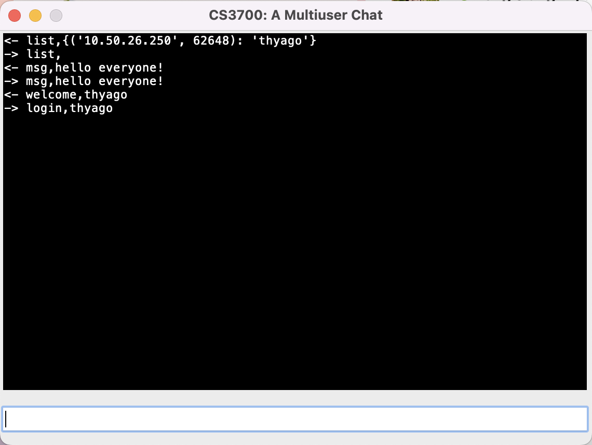

[](https://classroom.github.com/a/qoWU0BtF)
# Overview

The purpose of this assignment is to evaluate your understanding of socket programming in Python. You are required to develop a multiuser desktop chat application that uses sockets for communication.

# Requirements

* Each user is uniquely identified by their login name.
* The client side of the application must be multithreaded and include a Graphical User Interface (GUI).
* Communication between the client and server follows a simple protocol, which is described in the next section.

# Communication Model

* The server sends messages to all clients using a multicast group address. It receives messages from clients via a unicast UDP socket bound to a known port.
* The clients send messages to the server using unicast, and receive messages from the server through the same multicast group address used by the server.

# Messaging Behavior

* All messages sent by users are broadcast to all registered users.
* Private messaging is not supported in this application. 

# Communication Protocol

In the following protocol description, \<user\> and \<msg\> are to be replaced by the user's login name and the message string, respectively.

## Client to Server

```
login,<user>
```

This message is used by the client to communicate the user's name to the server.  

```
msg,<msg> 
```

This message is used by the client to send a message to the server so it can be relayed to all active users in the chat.  

``` 
list, 
```

This message is used by the client to request the server to send a list of all active users in the chat. Note that the protocol requires that all messages have a comma. 

```
exit, 
```

This message is used by the client to notify the server that the user wants to leave the chat. Note that the protocol requires that all messages have a comma. 

## Server to Client

```
welcome,<user> 
```

This message is used by the server to notify all users that a new user entered the chat. This message is always sent as a result of a login message sent by one of the users.  

```
msg,<msg> 
```

This message is used by the server to relay a message sent by a client to all active users in the chat.  

```        
bye,<user> 
```

This message is used by the server to notify all users that a user left the chat. This message is always sent as a result of an exit message sent by one of the users.  

``` 
list,<user>,<user>,...,<user> 
```

This message is used by the server to send a list of all active users in the chat. This message is always sent as a result of a list message sent by one of the users. 

# GUI (Graphical User Interface)

You are required to implement a GUI for the client that resembles the one below. 



You are free to implement a different GUI design, but the core functionality of the application must remain unchanged. The client’s GUI should clearly distinguish between incoming and outgoing messages. One suggested approach is to prefix incoming messages with "<-" and outgoing messages with "->". Additionally, the GUI should include a text input field where users can compose messages in accordance with the defined communication protocol.

There is no need to implement a GUI for the server. However, the server should display the messages that arrive to it using a format similar to the one shown below. 

```
Multiuser server is ready on 0.0.0.0:4321!
2024-09-23 13:52:29.308048 login request has arrived from thyago@('10.50.26.250', 62648)
2024-09-23 13:52:42.131629 msg "hello everyone!" has arrived from user: thyago@('10.50.26.250', 62648)
2024-09-23 13:52:52.786807 list request has arrived from user: thyago@('10.50.26.250', 62648)
```

# Concurrent Programming 

The client must be multithreaded to handle two concurrent tasks: running the GUI and responding to incoming messages from the server. The GUI must be implemented in the main thread, as required by most GUI frameworks. Since the client updates the interface both when sending and receiving messages, care must be taken to avoid race conditions that could arise from concurrent access to shared GUI components. 

# Testing 

The instructor should be able to run the submitted client with their own server. Conversely, the instructor should be able to run the submitted server with their own client. 

# Rubric

```
+10 the two server sockets were created and bound correctly (TODO #1)
+10 server 'login' type message was implemented correctly (TODO #2)
+10 server 'msg' type message was implemented correctly (TODO #2)
+10 server 'list' type message was implemented correctly (TODO #2)
+10 server 'exit' type message was implemented correctly (TODO #2)
+5 client's unicast UDP socket was created correctly (TODO #3)
+5 client's server address instance variable was initialized correctly (TODO #4)
+10 client's GUI was implemented in a way that matches the expected functionality (TODO #5)
+5 client allows users to send messages to the server (TODO #6)
+5 client allows users to display messages received by the server (TODO #7)
+5 client's mcast socket was created correctly (TODO #8)
+5 client's mcast socket was configured correctly (TODO #9)
+5 client's window instance variable was initialized correclty (TODO #10)
+5 thread's run code to read from the mcast socket and update the GUI was implemented correctly (TODO #11)
```